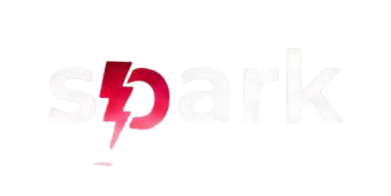
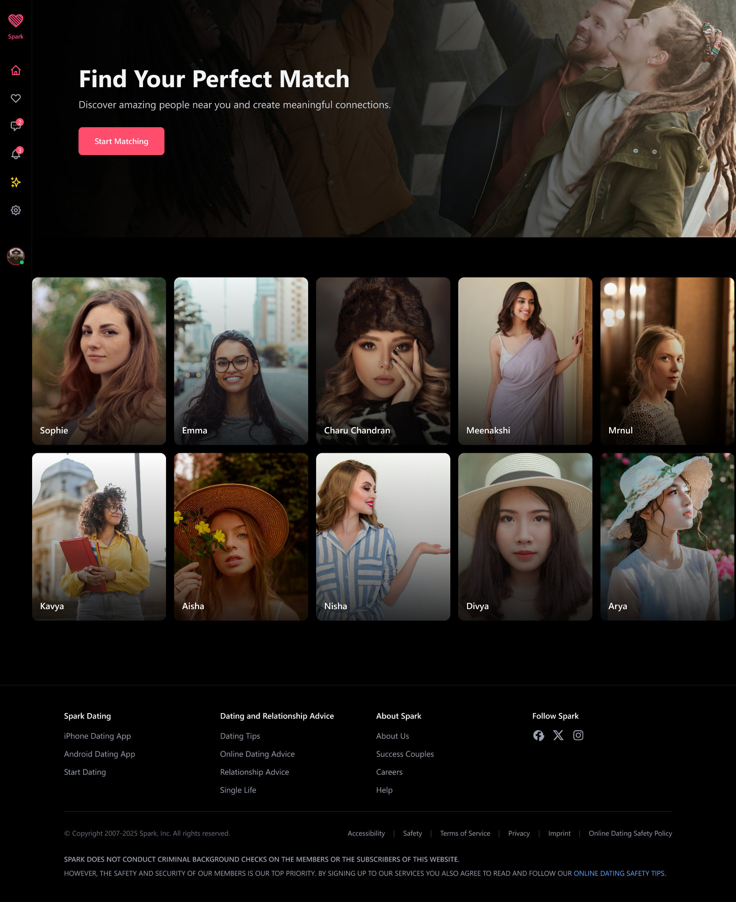

# Spark — Modern Dating Application (Frontend)

## Project Logo

Spark is a clean, responsive, and modern dating application interface built with Next.js.  
Designed for smooth interactions and a polished user experience, Spark provides the core UI foundation for a dating platform.

---

  <b>A clean, modern, high-performance dating application frontend built with Next.js.</b>

---

## Badges

  
  
  
  

---

## Live Demo

> 

Example:

---

## UI Preview

---

## Overview

Spark provides the essential user-facing interface of a modern dating platform.  
The UI is designed to be clean, minimal, visually appealing, and optimized for scalability.

---

## Features

- Responsive layout  
- Profile browsing grid  
- Clean card-based UI  
- Reusable React components  
- TailwindCSS for layout consistency  
- Ready for backend integration  
- Scalable file structure  

---

## Tech Stack

- **Next.js 16**  
- **React 19**  
- **TailwindCSS 4**  
- **ESLint 9**  
- **TypeScript (optional)**  

---